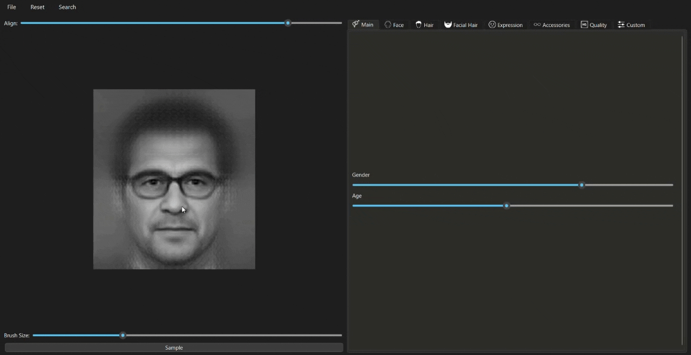
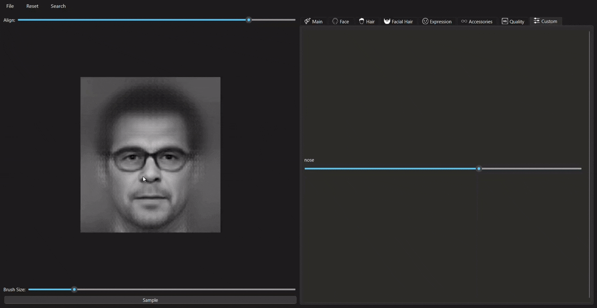
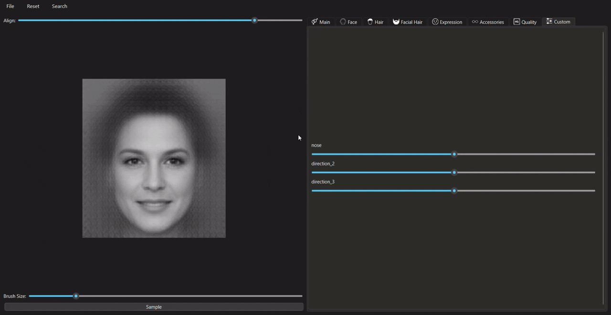

# Photorobot VAE

Photorobot VAE is an interactive application that lets you generate and edit facial composites through an intuitive search-and-optimize workflow.


## Key features

- **Predefined directions:** use precomputed semantic directions organized into groups for targeted feature adjustments;

- **Interactive facial feature editing:** select and modify specific facial regions through an optimization process using a brush tool;

- **Reference image encoding:** load and encode images into the VAE's latent space using an encoder or optimization with VGG-based perceptual loss.


## Search new semantic directions

1. Select facial features:
    - Navigate to **Search &rarr; Select** to enable paint mode;
    - Use the brush tool (adjustable size) to select a facial region.
2. Optimize Composite:
    - Go to **Search &rarr; Params** to configure optimization parameters (e.g., alpha, beta, learning rate);
    - Select **Search &rarr; Optimize** to start the optimization process.



<details>
  <summary>Another example</summary>

  

</details>

## Reference image encoding

Encode a reference image to guide composite generation:

- Using Encoder: Go to **File &rarr; Load using encoder** to select an image and encode it directly;

- Using Optimization: **Select File &rarr; Load using optimization** for VGG-based perceptual loss optimization.



## Optimization parameters

The optimization process uses a loss function defined as:

$\mathcal{L} = -\alpha \cdot L_1(x_{\text{opt}} \cdot M, x_{\text{init}} \cdot M) + \beta \cdot L_1(x_{\text{opt}} \cdot (1-M), x_{\text{init}} \cdot (1-M)) + \gamma \cdot L_1(z_{\text{opt}}, z_{\text{init}}) + \delta \cdot |z_{\text{opt}}|^2$

- α (Alpha): Weight for masked region L1 loss (default: 1e-1);
- β (Beta): Weight for unmasked region L1 loss (default: 1);
- γ (Gamma): Weight for latent L1 regularization (default: 1e-4);
- δ (Delta): Weight for latent L2 regularization (default: 1e-4);
- lr (Learning Rate): Optimization step size (default: 0.02);
- Steps: Number of optimization iterations (default: 100).

Adjust these via **Search &rarr; Params**.

## Quick start 

### Prerequisites

Python 3.13 or higher

### Setup

Install poetry:

```bash
$ curl -sSL https://install.python-poetry.org | python3 -
```

Install dependencies:

```bash
$ poetry install
```

Activate vitrual enviroment:

```bash
$ poetry shell
```

Run the application:

```bash
$ python src/app.py
```